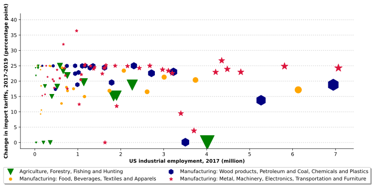

# Trade war impact on US labor market coding sample
## Introduction
This file is modified from the import analysis part of a work in progress of Xing Xu, UW-Madison (email: xxu457@wisc.edu). The original paper also discusses the export and joint analysis, with some extensions on import penetration from China. The essence of the work is to look at the labor market impacts of trade shocks, with detailed discussion on how the bilateral tariffs hit individual groups differently.

Why I created this coding sample? I am currently seeking PhD or RAship in economics. This github project is to be a good illustration of my coding skill and individual economic research ability, and more to be a way of communication with my future co-workers and friends. If you love Econ and data science just like me and want to discuss anything, shoot me an e-mail.

The Python file [Import Analysis](https://github.com/2xu2/Coding-sample/blob/main/Import%20analysis.ipynb) is the main file for data processing and [Plots_for_import_analysis](https://github.com/2xu2/Coding-sample/blob/main/Plots_for_import_analysis.ipynb) makes industry and county level plots. The Stata files performs panel regression and adopts an event study structure to analyze the import tariff at industry and county level. The R file (to be added in the next update) estimates the counterfactual import value supposing there had been no trade war using machine learning methods. The Matlab file (to be added in the next update) performs Monte-Carlo testing with simulated data.

## A short background
The US-China trade war started in July, 2018 following Trump's announcement of law enforcement towards unfair trading acts of China in March, 2018. Before the phase-one trade deall in Dec, 2021, tariffs on more than $550 billion of Chinese products was imposed by the US and China retaliated with tariffs on more than $185 billion of U.S. commodities. We can see the dynamics of the tariffs in the following graph: 

## Data processing
In [Import Analysis](https://github.com/2xu2/Coding-sample/blob/main/Import%20analysis.ipynb), I adopt the US import data from China from U.S. Census Bureau via API and combine it with the industry employment data from QCEW and the import tariff data from Bown (2021). Many subtleties when merging are discussed in the notebook. One point to mention is that since tariff data is at the 10-digit Harmonized System Code (HS10) level and the employment data is at the 4-digit North American Industry Classification System (NAICS4) level, I use the concordance table from Census Bureau and calculated the total import value and the weighted average tariff rate at NAICS4 level. 

### Employment data
The employment data used is the Quarterly Census of Employment and Wages (QCEW) by the U.S. Bureau of Labor Statistics surveying more than 95 percent of U.S. jobs by detailed industry. It is based on the 4-digit North American Industry Classification System (NAICS4) code and aggregated at different industrial and geographical levels. For example, manufacturing industries are coded from 31 to 33 at the NAICS2 level. If you want to look for a sub-industry like for rubber product manufacturing, it is coded 3262 at the 4-digit NAICS level. The Harmonized System discussed later works in a similar way, but it is designed for classifying trade commodities, with a different criteria. This paper specifically uses the employment and wage data from 2016 to the first quarter of 2020 at the county and the NAICS4 level. The employed population and unemployment rate are available monthly, while wages are only available quarterly.

### Import data
The paper mainly focuses on US trade data from 2016 to February, 2020. The import data used is from the U.S. Census Bureau international trade section data is based on HS10 commodities and we sum it up to NAICS4 industry level with the concordance table from Census Bureau and combine with the NAICS4 import tariff rate.

### Import tariff data
The tariff data is adopted from Bown (2021). Bown kept a careful log of the bilateral tariff change during the trade war at HS10 level for import tariff. The Harmonized System code is administrated by the World Customs Organization (WCO) to monitor international trade and the lowest level with 10-digit code (HS10) can be interpreted as commodities.

First, I use a weighted average of tariff rate by US total import value in 2017 to calculate the import tariff rates at the NAICS4 industry level. The next step is to project the tariff rates to US counties by estimating the county level exposures to tariff changes. Following Waugh(2019), I use the relative industry employment level to estimate each counties' exposures to the tariffs. 

Formally, the county level exposure to US import tariff on China is defined as:\
\
Where  is the exposure, E is the 2017 base level county and industry level employment,  is the US tariff to China imports.

## Plotting
In [Plots_for_import_analysis](https://github.com/2xu2/Coding-sample/blob/main/Plots_for_import_analysis.ipynb), I make two plots, one on the change in import tariffs for industries and one on the exposure change to import tariffs of counties. 
The industry level plot shows the US subindustry groups' import tariff change. The size of the markers indicate the relative employment level of the industry subgroups in the NAICS2 industries.\
\
The county level plot shows the geographic impact of the import tariff. We can see a clear geographic distribution of the policy impact. People in the east and central are much more affected by the policy in general.\

## Panel regression and event study
